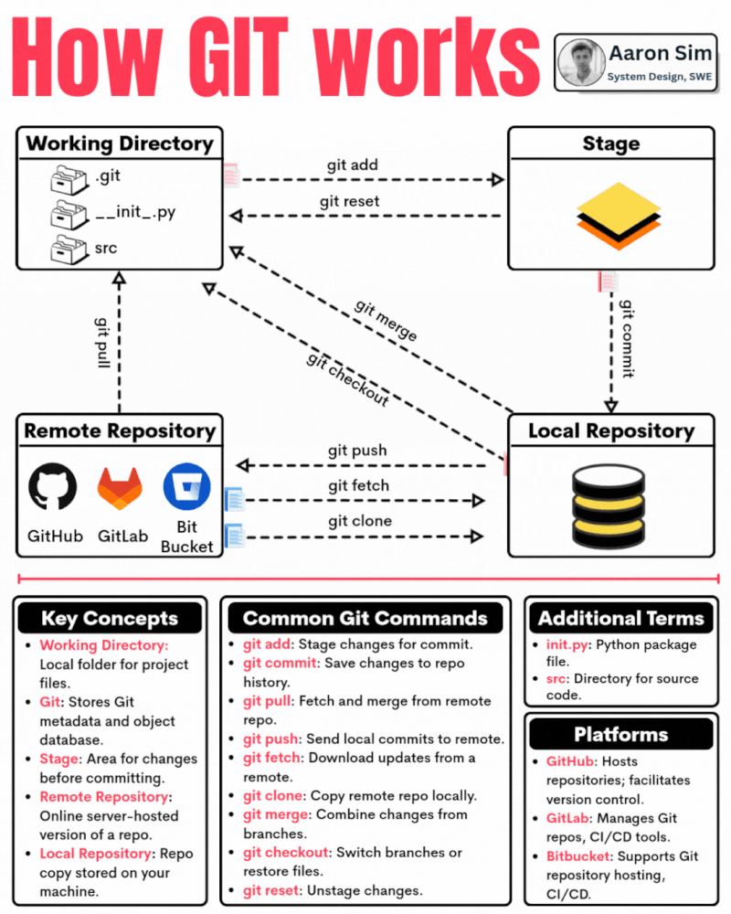

# Git-cheat-sheet

| Command                                  | Description                                                   |
|------------------------------------------|---------------------------------------------------------------|
| `git init`                               | Initialize a new Git repository.                              |
| `git clone <repository-url>`             | Clone a remote repository to your local machine.             |
| `git add <file>`                         | Add changes from the working directory to the staging area.  |
| `git commit -m "Commit message"`         | Commit staged changes with a descriptive message.           |
| `git status`                             | View the status of your working directory and staged files. |
| `git log`                                | Display the commit history.                                  |
| `git branch`                             | List all branches in the repository.                         |
| `git checkout <branch>`                  | Switch to a different branch.                                |
| `git merge <branch>`                     | Merge changes from one branch into the current branch.      |
| `git pull origin <branch>`               | Fetch and merge changes from a remote repository.           |
| `git push origin <branch>`               | Push local commits to a remote repository.                   |
| `git remote -v`                          | List remote repositories and their URLs.                    |
| `git remote add <name> <repository-url>` | Add a new remote repository.                                 |
| `git diff`                               | Show changes between working directory and last commit.     |
| `git reset <file>`                       | Unstage changes from the staging area.                      |
| `git stash`                              | Temporarily save changes that are not ready to commit.      |
| `git restore <file>`                     | Discard changes in working directory for a specific file.   |
| `git branch -d <branch>`                 | Delete a branch locally.                                    |
| `git pull --rebase origin <branch>`      | Fetch and reapply commits from a remote repository.         |
| `git tag <tag-name>`                     | Create a lightweight tag for a specific commit.             |
| `git config --global <key> <value>`      | Set a global Git configuration option.                      |
|--------------------------------------|------------------------------------------------------------------------|
| `git switch <branch>`                | Switch to an existing branch.                                          |
| `git switch -c <new-branch>`         | Create and switch to a new branch.                                     |
| `git switch -`                       | Switch to the previously checked out branch.                          |
| `git switch -d <branch>`             | Delete a local branch (if fully merged).                               |
| `git switch -c <new-branch> <start-point>` | Create a new branch starting from a specific commit or branch.     |
| `git switch --guess`                 | Attempt to guess the desired local branch based on the current state. |
| `git switch --track <remote-branch>` | Create a new branch that tracks a remote branch.                      |
| `git switch --detach <commit>`       | Detach HEAD at a specific commit, creating a 'detached HEAD' state.   |
|-----------------------------------------------|-------------------------------------------------------------|
| `git fetch <remote>`                          | Download objects and refs from another repository.         |
| `git remote show <remote>`                    | Display detailed information about a remote repository.    |
| `git checkout -b <new-branch>`                | Create and switch to a new branch.                         |
| `git branch -a`                              | List all remote and local branches.                       |
| `git merge --abort`                          | Abort a conflicted merge operation.                       |
| `git rebase <branch>`                        | Reapply commits from another branch on top of current.    |
| `git cherry-pick <commit>`                   | Apply a specific commit to the current branch.            |
| `git log --oneline`                          | Display a simplified commit history.                     |
| `git diff <commit> <commit>`                 | Show changes between two specific commits.                |
| `git remote rename <old-name> <new-name>`    | Rename a remote repository.                               |
| `git rm <file>`                              | Remove a file from the working directory and stage.       |
| `git tag -a <tag-name> -m "Tag message"`     | Create an annotated tag with a message.                  |
| `git blame <file>`                           | Show who changed each line of a file and when.            |
| `git commit --amend`                        | Modify the last commit message or include new changes.   |
| `git log --graph --oneline --all`            | Display a compact commit history with branch graph.      |
| `git clean -n`                               | Show which untracked files will be removed.               |
| `git remote remove <remote>`                 | Remove a remote repository.                              |
| `git reflog`                                | View a log of reference (HEAD) changes.                 |
| `git revert <commit>`                       | Create a new commit that undoes a specific commit.       |
| `git reset --hard <commit>`                  | Reset the repository and working directory to a commit.  |
|----------------------------------------------|------------------------------------------------------------|
| `git submodule add <repository-url>`         | Add a submodule to your repository.                       |
| `git submodule update --init`                | Initialize and update submodules.                         |
| `git log --author=<author>`                  | Display commit history by a specific author.              |
| `git log --since=<date>`                     | Show commits since a specific date.                      |
| `git log --grep=<pattern>`                   | Search commit messages for a specific pattern.           |
| `git diff --cached`                         | Show changes in the staging area.                        |
| `git stash list`                            | List all stashed changes.                                |
| `git stash pop`                             | Apply the most recent stash and remove it from the list. |
| `git stash apply <stash>`                   | Apply a specific stash.                                 |
| `git stash drop <stash>`                    | Remove a specific stash.                                |
| `git cherry <start-commit> <end-commit>`     | Show commits in one branch that aren't in another.      |
| `git clean -f`                              | Remove untracked files from the working directory.      |
| `git log --stat`                            | Display the file changes in each commit.                |
| `git rebase -i <commit>`                    | Interactively rebase commits and squash or edit them.   |
| `git blame -L <start>,<end> <file>`          | Annotate specific lines in a file with commit info.     |
| `git log --since=<time>`                    | Show commits since a specific time (e.g., "2 weeks ago"). |
| `git revert --no-commit <commit>`           | Revert changes from a specific commit without committing. |
| `git stash branch <new-branch>`             | Create a new branch from a stash.                      |
| `git bisect start`                          | Start a binary search for a faulty commit.              |
| `git bisect good <commit>`                  | Mark a commit as good in a binary search.              |
| `git bisect bad <commit>`                   | Mark a commit as bad in a binary search.               |

 

    

